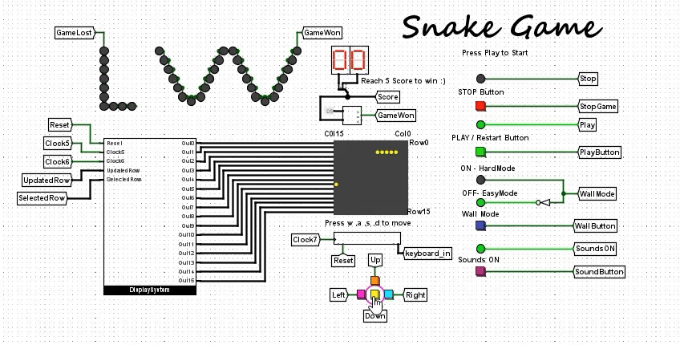
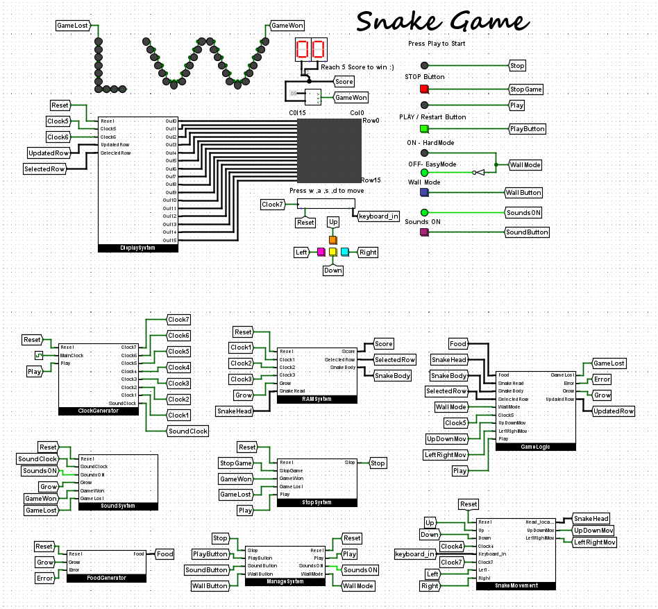

# **Snake Game - Logisim Evolution 🐍🎮**

A classic **Snake Game** implemented entirely in digital logic using [Logisim Evolution](https://github.com/logisim-evolution/logisim-evolution)! Dive into the nostalgia of retro gaming with a twist of modern features, all simulated in a circuit design environment.

---

## **🎮 Game Overview**
This Snake Game offers simple yet engaging gameplay where the player controls a snake, navigating it to eat fruits while avoiding obstacles and itself. Test your reflexes and strategic thinking with two exciting modes of play:

### **Modes**
- **Easy Mode**: The snake wraps around the edges of the screen when it hits a wall.
- **Hard Mode**: Hitting a wall ends the game instantly.

---

## **🌟 Features**
- **Controls**: 
  - Play using on-screen buttons.
  - Use keyboard keys (`A`, `S`, `D`, `W`) for smooth navigation.
- **Game Modes**: Toggle between Easy and Hard modes to match your skill level.
- **Score System**: 
  - Eat fruits to gain points. 
  - Reach **5 points** to win the game!
- **Game Over Conditions**: 
  - The snake eats itself.
  - (Hard Mode) The snake hits a wall.
- **Sounds**: Toggle game sounds on or off based on your preference.

---

## **🎥 Preview**
Here’s a glimpse of the Snake Game in action:



---

## **🖼️ Screenshots**

### **Start Screen**
This is how the game begins, with options to toggle modes and sound settings:



---

## **🛠️ How It Works**
The game is designed using digital logic circuits and components in Logisim Evolution:
- **Logic Implementation**: The game uses registers, counters, and gates to manage movement, collision detection, and scoring.
- **Timing**: A clock module ensures smooth gameplay by synchronizing movements.
- **Modes**: A mode selector toggles wall behavior between wrapping and collision.
- **Sound Control**: A logic-based toggle enables or disables game sounds.

---

## **📂 Repository Structure**
```plaintext
logisim-snake-game/
├── assets/                # Images and videos of the simulation
│   ├── snake_game_demo.gif
│   ├── screenshot1.png
│   └── in_game.png
│   └── start_screen.png
├── circuits/              # Circuit files (.circ)
│   └── snake_game.circ
├── README.md              # Project overview
└── LICENSE                # License file
